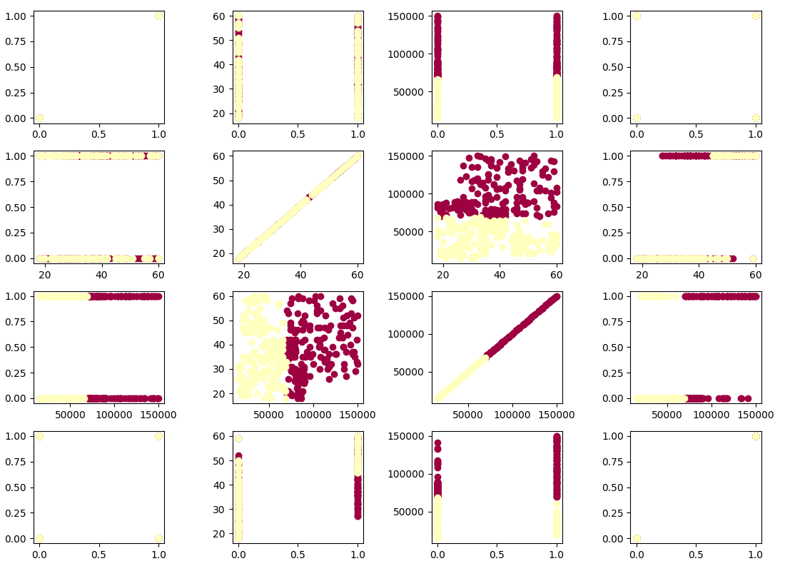
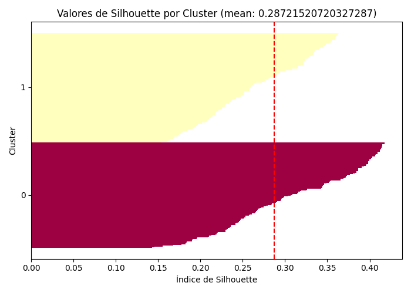
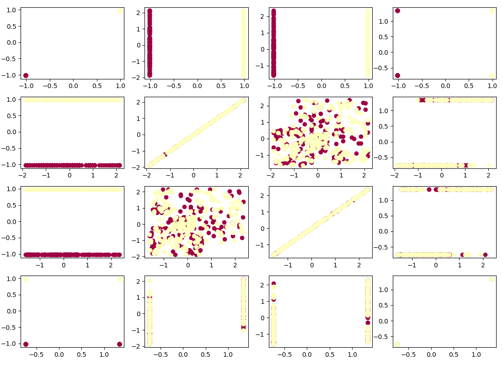

# Tarea 5

## Instalación

### Repositorio

[https://github.com/hyfi06/pcic-ai241/tree/tarea-5](https://github.com/hyfi06/pcic-ai241/tree/tarea-5)

```bash
git clone https://github.com/hyfi06/pcic-ai241.git

git checkout tarea-5
```

### Python version

- Python 3.10.6

### Entorno virtual

```bash
cd Tarea\ 5
python3 -m venv venv
source venv/bin/activate
```

### Instalación de dependencias

```
pip install --upgrade pip
pip install -r requirements.txt
```

## Ejecución

### KMeans

Implentación en https://github.com/hyfi06/pcic-ai241/blob/tarea-5/Tarea%205/algorithms/kmeans.py

Se aplicó al data set Social_Network_Ads.csv

```bash
python3 social_network_ads.py
```

Resultados:

Para 2 clusters los resultados obtenidos fueron los siguientes:

```
Iteraciones: 6
[[4.92957746e-01 3.77746479e+01 9.62112676e+04 4.29577465e-01]
 [5.07246377e-01 3.68405797e+01 4.27826087e+04 2.39130435e-01]]
```


Gráfica de los clusters:



El algoritmo divide por la variable de salarios, debido a que es la que contribuye más a la distancia.

Para evitar esta gran diferencia entre las variables, se agregó a la función de carga de los datos una opción de regresar los valores estandarizados.

Los resultados fueron los siguientes:

```
Iteraciones: 3
[[-1.01892801 -0.01931199  0.04158975  0.01555337]
 [ 0.97897005 -0.06114867  0.05164673  0.0419335 ]]

```



Gráfica de los clusters:



En este análisis los datos se dividieron principalmente por el género.
